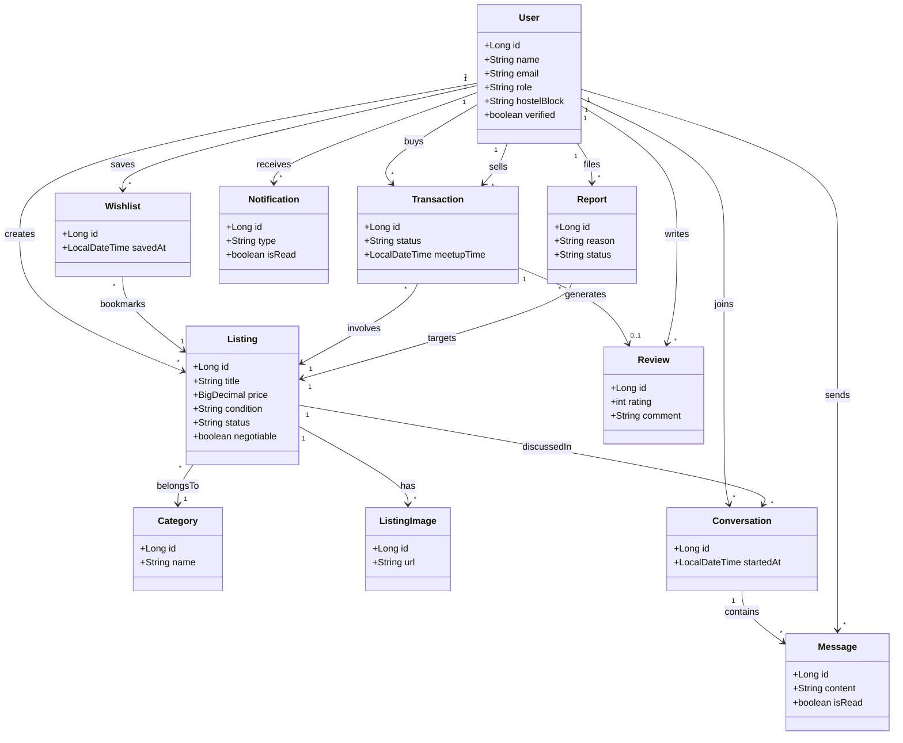

# Chitkara CampusMart — Java Backend

A peer-to-peer marketplace built for Chitkara University students to buy, sell, and exchange books, electronics, hostel essentials, cycles, and more — backed by a Java (Spring Boot) REST API.

> Frontend reference: https://ucampus-mart.vercel.app/

## Status

This repo currently covers the **planning and design phase**:

- [x] Feature backlog defined (73 features across 12 categories, phased into 4 build stages)
- [x] Core domain model / class diagram designed
- [ ] Spring Boot project scaffolding
- [ ] Entity + repository layer implementation
- [ ] REST controllers and service layer
- [ ] Authentication (JWT + college-email verification)
- [ ] Real-time chat (WebSocket)
- [ ] Deployment

## Tech stack (planned)

| Layer | Choice |
|---|---|
| Language | Java 17+ |
| Framework | Spring Boot 3.x (Spring Web, Spring Data JPA, Spring Security) |
| Database | PostgreSQL |
| Real-time | WebSocket / STOMP |
| Caching | Redis |
| Search | Elasticsearch (or Postgres full-text search for MVP) |
| Auth | JWT + OAuth2 (Google, restricted to college domain) |
| File storage | AWS S3 / Cloudinary |
| Build tool | Maven or Gradle |

## Domain model

Core entities and their relationships (renders natively on GitHub):



**Notes on the model**

- `User` is the hub of the schema — it plays multiple roles (seller, buyer, reviewer, chat participant), rather than being split into subclasses.
- `Wishlist` is a join entity between `User` and `Listing`, not a plain many-to-many, because it carries its own `savedAt` timestamp.
- `Transaction` holds two references to `User` (`buyer` and `seller`).
- `Conversation` links a `User` pair to a `Listing` and owns the `Message` thread for real-time chat.
- `Review` is optional (`0..1`) off `Transaction` — a completed deal may or may not be reviewed.

## Feature roadmap

The full backlog (73 features) lives in [`docs/CampusMart_Java_Backend_Features.xlsx`](./docs/CampusMart_Java_Backend_Features.xlsx) — filterable by category and phase, with a live-formula summary sheet. High-level breakdown:

| Category | Features | Primary phase |
|---|---|---|
| Authentication & Authorization | 8 | 1–3 |
| User & Profile Management | 6 | 1–3 |
| Product Listing Management | 10 | 1–4 |
| Search & Discovery | 7 | 1–4 |
| Chat & Communication | 6 | 3–4 |
| Transactions & Deals | 7 | 2–4 |
| Reviews, Ratings & Trust | 5 | 2–4 |
| Notifications | 4 | 1–4 |
| Wishlist & Personalization | 3 | 2–4 |
| Admin & Moderation Panel | 6 | 2–3 |
| Security & Infrastructure | 6 | 1–3 |
| Advanced / Nice-to-Have | 5 | 4 |
| **Total** | **73** | |

**Build order**

1. **Phase 1 — MVP:** Auth, profile, listings CRUD, basic search/filter, email notifications
2. **Phase 2 — Core marketplace:** Mark-as-sold flow, ratings/reviews, wishlist, admin panel, rate limiting
3. **Phase 3 — Engagement:** Real-time WebSocket chat, push notifications, Redis caching, analytics
4. **Phase 4 — Growth:** Payments/boosts, barter & rental listings, auction bidding, recommendation engine, geolocation

## Getting started

```bash
git clone https://github.com/<your-username>/campusmart-backend.git
cd campusmart-backend

# configure DB credentials in src/main/resources/application.yml

./mvnw spring-boot:run
```

## Project structure (proposed)

```
src/main/java/com/campusmart/
├── config/          # Security, CORS, WebSocket config
├── controller/       # REST controllers
├── service/          # Business logic
├── repository/        # Spring Data JPA repositories
├── entity/            # JPA entities (see domain model above)
├── dto/               # Request/response DTOs
├── security/          # JWT filters, auth providers
└── exception/         # Global exception handling
```

## Contributing

This is a student project. Issues and pull requests are welcome — please open an issue describing the feature (referencing the roadmap table above) before submitting a PR.

## License

MIT License

Copyright (c) 2026 CampusMart Contributors

Permission is hereby granted, free of charge, to any person obtaining a copy
of this software and associated documentation files (the "Software"), to deal
in the Software without restriction, including without limitation the rights
to use, copy, modify, merge, publish, distribute, sublicense, and/or sell
copies of the Software, and to permit persons to whom the Software is
furnished to do so, subject to the following conditions:

The above copyright notice and this permission notice shall be included in all
copies or substantial portions of the Software.

THE SOFTWARE IS PROVIDED "AS IS", WITHOUT WARRANTY OF ANY KIND, EXPRESS OR
IMPLIED, INCLUDING BUT NOT LIMITED TO THE WARRANTIES OF MERCHANTABILITY,
FITNESS FOR A PARTICULAR PURPOSE AND NONINFRINGEMENT. IN NO EVENT SHALL THE
AUTHORS OR COPYRIGHT HOLDERS BE LIABLE FOR ANY CLAIM, DAMAGES OR OTHER
LIABILITY, WHETHER IN AN ACTION OF CONTRACT, TORT OR OTHERWISE, ARISING FROM,
OUT OF OR IN CONNECTION WITH THE SOFTWARE OR THE USE OR OTHER DEALINGS IN THE
SOFTWARE.

